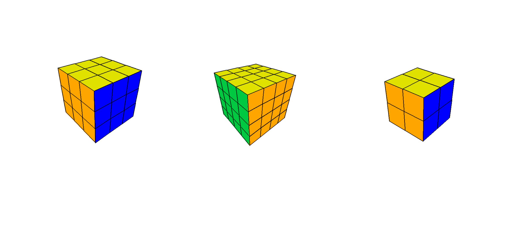

# RubiCube
Game - Simulator of Rubiks Cube

Install packages :
        'pip install -r escort/requierments.txt'

Running :
        start 'main.py' file

Keys :

    1)camera view:
    
        mode    = 'o'
        rotate  = 'MMB + mouse'
        fov     = 'MMB4' / 'MMB5'
        zoom    = '+' / '-'
        
    2)cube moving languge:
    
        (+ U) / (- U) = 'w' / 'shift + w'
        (+ D) / (- D) = 's' / 'shift + s'
        (+ F) / (- F) = 'e' / 'shift + e'
        (+ B) / (- B) = 'q' / 'shift + q'
        (+ R) / (- R) = 'd' / 'shift + d'
        (+ L) / (- L) = 'a' / 'shift + a'