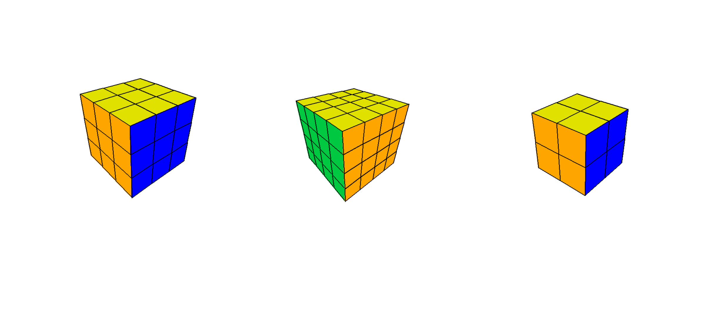

# Cubie

[](https://pypi.org/project/pygame/)

Simulator of Puzzles

------



**Install requirement packages** :

```python
    pip install -r requierments.txt
```
        
**Running**:

```python
    python main.py
```
------

**Keys**:

1. Camera view:

Action|Key         |Alternative|
-----:|:----------:|:---------:|
mode  | O          |`-----`    |
rotate| MMB + MOUSE|`-----`    |
fov   | MMB4       | MMB5      |
zoom  | +          |`-----`    |
        
2. Cube moving languge:
    
|Action|Key  |Alternative         |
|:----:|:---:|:------------------:|
|   U  |  W  | PRESSED_SHIFT + W  |
|   D  |  S  | PRESSED_SHIFT + S  |
|   F  |  E  | PRESSED_SHIFT + E  |
|   B  |  Q  | PRESSED_SHIFT + Q  |
|   R  |  D  | PRESSED_SHIFT + D  |
|   L  |  A  | PRESSED_SHIFT + A  |
